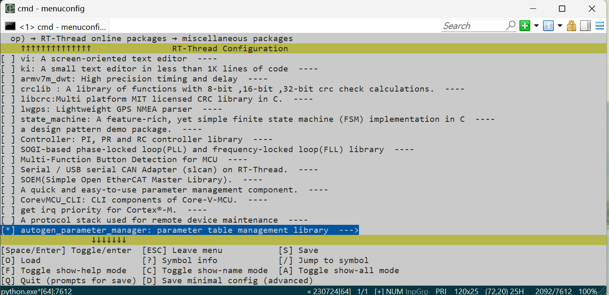
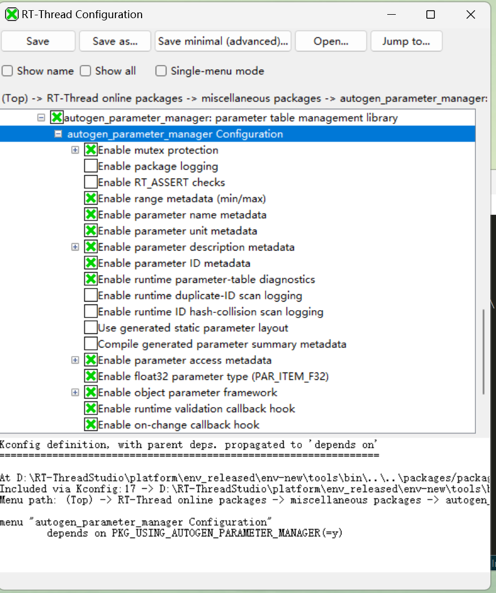

[中文](./README.zh-CN.md)

# autogen_parameter_manager

`autogen_parameter_manager` is an RT-Thread package wrapper for a generated firmware parameter-table manager. It combines a portable parameter core with RT-Thread build files, RT-Thread port glue, optional MSH tooling, and optional persistent-storage backends.

Use this package when product firmware needs a fixed parameter schema with typed access APIs, stable IDs, generated layout information, metadata, range/access validation, and controlled NVM persistence. It is not a general Flash KV database, TSDB, IAP storage library, or logging backend.

## Source repository layout

```text
.
├── Kconfig                         # RT-Thread package options used by menuconfig
├── SConscript                      # RT-Thread/SCons source selection
├── backend/                        # RT-Thread-facing storage backend bridges
├── port/                           # RT-Thread port files and optional MSH command
├── par_table.def                   # Generated X-Macro table used by this package profile
└── parameters/                     # Portable Device Parameters module
```

## Usage: enable and fetch the package from an RT-Thread BSP

### 1. Enter the BSP project directory

Enter the BSP directory that will use this package, for example:

```sh
cd rt-thread/bsp/stm32/stm32f407-st-discovery
```

### 2. Open the configuration UI

Use RT-Thread Env or a regular shell to open the configuration UI:

```sh
menuconfig
```

If the project uses the SCons Python configuration flow, use:

```sh
scons --pyconfig
```

### 3. Select the package

In the configuration UI, enable this package from:

```text
RT-Thread online packages
    miscellaneous packages
        autogen_parameter_manager: parameter table management library
```



### 4. Configure package features

Open `autogen_parameter_manager Configuration` and select only the features needed by the project.

| Option group | Typical setting | Notes |
| --- | --- | --- |
| Core metadata | Enable name/unit/description/range as needed | Disable unused metadata to reduce ROM. |
| Object types | Enable only if `STR`, `BYTES`, or array parameter rows are used | Scalar-only products can disable object types. |
| Generated layout | Enable `AUTOGEN_PM_LAYOUT_SOURCE_SCRIPT` after generated layout files are committed | Otherwise the table is scanned at startup. |
| MSH shell tool | Enable when `RT_USING_FINSH` is enabled and board-side inspection is required | Builds the `par` command. |
| NVM persistence | Enable only when persistent rows are used | Select exactly one scalar backend path when scalar persistence is needed. |



### 5. Save the configuration

After saving, the BSP `.config` should contain an entry similar to:

```text
PKG_USING_AUTOGEN_PARAMETER_MANAGER=y
```

The package manager fetches packages according to the saved `.config`, so the selection must be saved first.

### 6. Update and fetch packages

After selecting and saving the package, run one of the following commands from the BSP directory to update and fetch the package source.

Common RT-Thread Env / command-line flow:

```sh
pkgs --update
```

SCons Python configuration flow:

```sh
scons --pyconfig
```

Select one flow according to the project environment. After a successful fetch, the BSP directory should contain a package directory similar to:

```text
packages/autogen_parameter_manager-latest/
```

If `pkgs --update` clones the repository but checkout fails, for example `pathspec 'main' did not match any file(s) known to git`, check whether the `VER` field in `package.json` matches an existing remote branch or tag.

### 7. Build the project

After the package is fetched, build the BSP normally:

```sh
scons -j8
```

On Linux, this is also commonly used:

```sh
scons -j$(nproc)
```

## Parameter table workflow

The editable schema is `parameters/schema/par_table.csv`. After editing parameter rows, IDs, generator configuration, or templates, regenerate the build inputs from the package source root:

```sh
python3 parameters/tools/pargen.py
```

The default generator inputs and outputs are:

| Path | Role |
| --- | --- |
| `parameters/schema/par_table.csv` | Editable parameter schema. |
| `parameters/schema/par_id_lock.json` | Stable enum-to-ID lock file. |
| `parameters/schema/pargen.json` | Generator configuration. |
| `par_table.def` | Generated X-Macro table compiled by `parameters/src/def/par_def.c`. |
| `parameters/generated/` | Generated static layout, generated info, and manifest files. |

Use validation-only or CI checks when needed:

```sh
python3 parameters/tools/pargen.py --check
python3 parameters/tools/pargen.py --verify
```

## SCons integration model

The package source root must remain the directory downloaded by RT-Thread package management. `SConscript` calls `DefineGroup()` and conditionally adds source files according to Kconfig symbols. Do not include backend adapters or test files directly from the BSP; select them through `menuconfig` or `scons --pyconfig` instead.

Main source-selection rules:

- Core scalar/object/table sources are compiled whenever `PKG_USING_AUTOGEN_PARAMETER_MANAGER` is enabled.
- `port/par_shell_tool.c` is compiled only when `AUTOGEN_PM_USING_MSH_TOOL` is enabled.
- NVM core and layout files are compiled only when `AUTOGEN_PM_USING_NVM` and the corresponding layout options are enabled.
- AT24CXX or flash-ee backend bridges are compiled only when the selected backend needs them.
- Runtime/manual tests are compiled only when `AUTOGEN_PM_USING_TESTS` and the specific test options are enabled.

## Minimal BSP-side use

After the package is enabled, fetched, and built, include the public API from application code:

```c
#include <par.h>

void parameter_init(void)
{
    (void)par_init();
}
```

Use the typed APIs and IDs generated from `par_table.def`. For board-specific policy, update `port/par_cfg_port.h` and keep product-specific storage region settings in Kconfig or the BSP board configuration.

## NVM backend selection

When persistence is enabled, select one backend path for scalar persistence:

| Backend | Kconfig path | Use when |
| --- | --- | --- |
| RT-Thread AT24CXX | `AUTOGEN_PM_USING_RTT_AT24CXX_BACKEND` | Parameters are stored in an external AT24CXX-compatible EEPROM. |
| flash-ee through FAL | `AUTOGEN_PM_USING_FLASH_EE_BACKEND` + `AUTOGEN_PM_FLASH_EE_PORT_FAL` | A dedicated RT-Thread FAL partition is available. |
| flash-ee native | `AUTOGEN_PM_USING_FLASH_EE_BACKEND` + `AUTOGEN_PM_FLASH_EE_PORT_NATIVE` | The BSP provides native flash read/program/erase hooks. |

Reserve a storage region that is owned only by this package. Do not share the same EEPROM window or Flash partition with another KV database, filesystem, log area, or bootloader storage.

## Documentation

- [Module README](parameters/README.md) is the portable module entry point.
- [Documentation overview](parameters/docs/overview.md) maps reader goals to detailed documents.
- [Getting started](parameters/docs/getting-started.md) covers required files, build inputs, and first-use examples.
- [CSV parameter generator](parameters/docs/csv-generator.md) covers schema maintenance, validation, ID allocation, and generated layout files.
- [RT-Thread package integration](parameters/docs/rt-thread-package.md) describes wrapper responsibilities and validation points.
- [Difference from FlashDB and EasyFlash](parameters/docs/flashdb-easyflash-comparison.md) explains the package boundary against common Flash storage libraries.
- [Architecture](parameters/docs/architecture.md) describes the runtime model, layout, validation, ID lookup, and NVM split.
- [API reference](parameters/docs/api-reference.md) groups public APIs by responsibility.
- [Test overview](parameters/tests/README.md) indexes runtime tests, manual NVM tests, generator tests, and backlog items.
