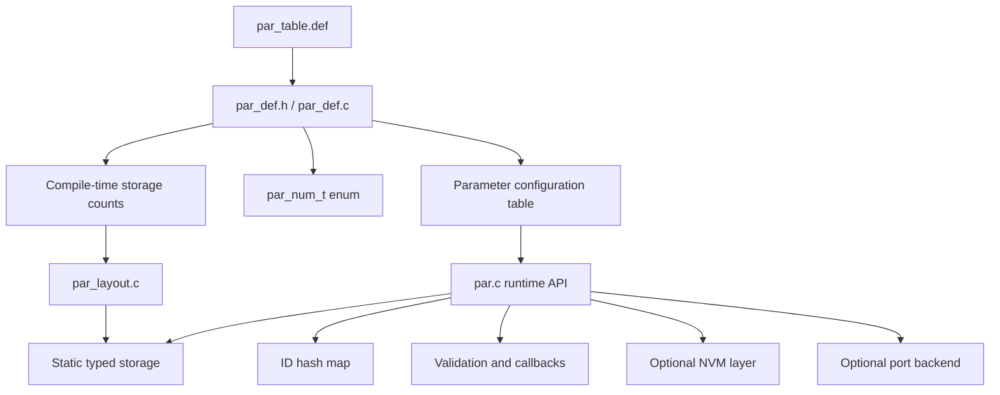

# Architecture

This document explains how the module is structured internally and how the major pieces work together.

## High-level model

The module separates four concerns:

1. **Parameter definition** through `par_table.def`
2. **Core runtime access** through `par.c` and `par.h`
3. **Layout and storage** through `par_layout.*`
4. **Optional platform and NVM integration** through `par_if.*`, `par_atomic.h`, and `par_nvm.*`



## Single-source parameter definition

`par_table.def` is intentionally included multiple times with different macro definitions.

That makes one definition file drive multiple generated artifacts:

- `par_num_t` enumeration in `par_def.h`
- configuration table access through `par_def.c`
- compile-time validation for integer parameter ranges
- compile-time storage group counts for layout

This design reduces duplication and helps keep enum values, metadata, and storage assumptions aligned.

## Internal vs external identification

The module uses two identifiers for each parameter.

### `par_num_t`

`par_num_t` is the internal firmware-facing identifier.

Use it when code inside the firmware directly accesses parameters.

Characteristics:

- dense enum-like index
- efficient for table-based access
- not intended to be stable across arbitrary reordering of the parameter list

### `id`

`id` is the external identifier stored in parameter metadata.

Use it when parameters must be addressed by external systems such as:

- CLI commands
- PC tools
- diagnostic frames
- protocol bridges

This separation lets firmware use an efficient internal index while external tooling uses a stable numeric contract.

## Storage model

The module stores live values in static width-based groups instead of allocating each parameter separately on the heap.

Storage groups:

- 8-bit group for `U8`, `I8`
- 16-bit group for `U16`, `I16`
- 32-bit group for `U32`, `I32`, `F32`

Benefits:

- predictable RAM usage
- no runtime heap dependency for live storage
- compact grouping by data width

At runtime, each parameter resolves to:

- a storage group based on its type
- an offset inside that group

### How default values are applied at startup

Live storage is initialized in two phases during startup:

1. Integer default values from `par_table.def` are compiled directly into the shared storage arrays.
2. `F32` default values are written into the shared 32-bit storage after layout offsets are available.

This means `par_init()` does not need to apply startup defaults through the public setter path for every parameter.

### Ordering contract for shared storage

Within each width-based storage group, element order follows `par_table.def` entry order filtered by the types supported by that group.

That ordering contract matters because:

- compile-time integer default initializers depend on it
- runtime layout offset generation depends on it
- both sides must stay aligned so each parameter lands in the correct slot

If the filtered storage order and the runtime layout scan order ever diverge, defaults can be written into the wrong storage positions.

## Layout subsystem

The layout subsystem provides the offset map that connects each parameter to its location in the static typed storage.

The layout step is also what makes it possible to patch `F32` defaults correctly, because floating-point values share the 32-bit storage group and need their final offsets first.

### Compile-scan mode

When:

```c
#define PAR_CFG_LAYOUT_SOURCE PAR_CFG_LAYOUT_COMPILE_SCAN
```

`par_layout_init()` scans the parameter table during initialization and builds offsets dynamically.

Use this mode when you want a self-contained integration with no external code generation step.

### Script-layout mode

When:

```c
#define PAR_CFG_LAYOUT_SOURCE PAR_CFG_LAYOUT_SCRIPT
```

layout data is provided by a generated static header and consumed directly.

Use this mode when your tooling already owns parameter generation or when you want fixed layout data before compilation.

## Validation model

Validation happens in two stages.

### Compile-time validation

Compile-time validation is used for integer parameter types:

- `U8`
- `I8`
- `U16`
- `I16`
- `U32`
- `I32`

Typical checks include:

- `min <= max`
- `def >= min`
- `def <= max`

These checks are generated from `par_table.def`, so invalid integer configurations fail at build time.

### Runtime validation

Runtime validation is used for checks that are better handled dynamically, including:

- floating-point range validation
- `name != NULL` when name metadata is enabled
- `desc != NULL` when description metadata is enabled
- description policy checks through `par_port_is_desc_valid()` when enabled
- per-parameter application validation callbacks

This split keeps integer configuration errors out of the firmware image while still allowing flexible runtime policies.

## ID lookup path

The module supports ID-based APIs such as `par_get_by_id()` and `par_set_by_id()`.

Because external IDs do not need to be sequential, the runtime builds a hash map during `par_init()`.


### Collision policy

The current implementation uses a strict one-entry-per-bucket map.

That means:

- duplicate IDs are rejected
- hash collisions are rejected during initialization

This keeps runtime lookup simple and deterministic, but it also means a conflicting ID assignment must be fixed at the source.

## Normal path vs fast path

The module exposes both normal setters and fast setters.

### Normal setters

Normal setters are the default path. They are intended for ordinary application code where correctness and observability matter more than shaving off a few instructions.

### Fast setters

Fast setters are specialized APIs for controlled hot paths. They reduce overhead, but they should only be used when the surrounding code already guarantees the assumptions that the full path would normally check.

## Optional NVM persistence

When `PAR_CFG_NVM_EN = 1`, the module can persist selected parameters to NVM.

NVM persistence uses the parameter metadata, persistence flags, CRC handling, and table hash validation to detect incompatible or corrupted stored data.

For this feature, the external NVM module must be available in the project.

## Portability model

The module stays portable by keeping platform-specific logic behind dedicated boundaries.

### Core portable layer

Implemented under `src/`:

- parameter storage
- parameter metadata access
- validation and callbacks
- layout handling
- ID lookup
- optional NVM support

### Port-specific layer

Implemented by the integrator as needed:

- `par_cfg_port.h`
- `par_if_port.c`
- `par_atomic_port.h`

This separation makes the core reusable while still allowing the target platform to provide mutexes, logging, assertions, and atomic primitives.
